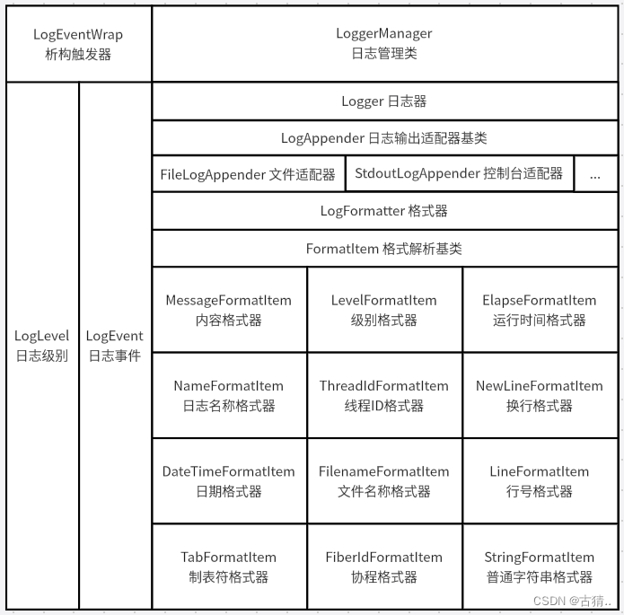
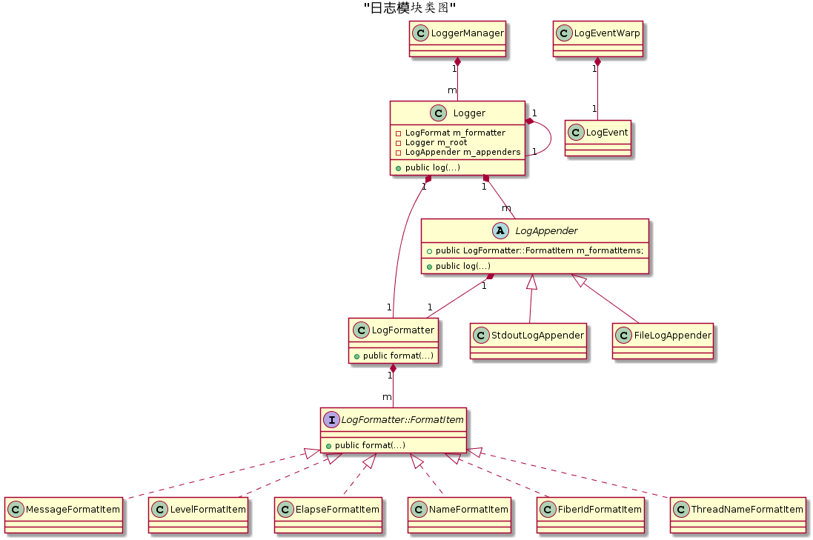
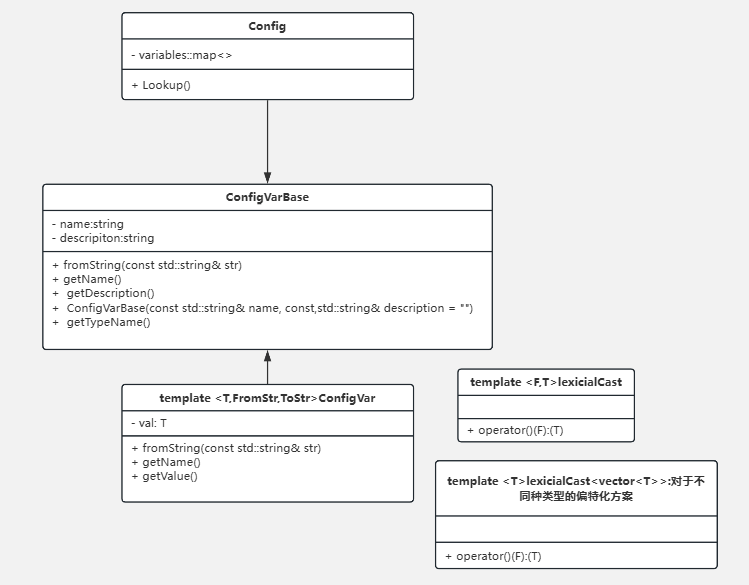
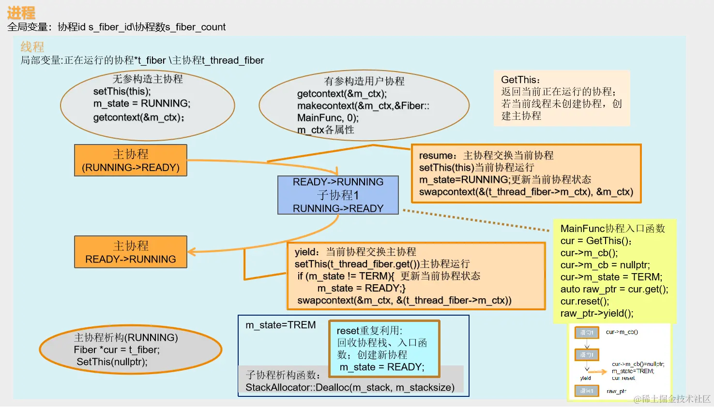
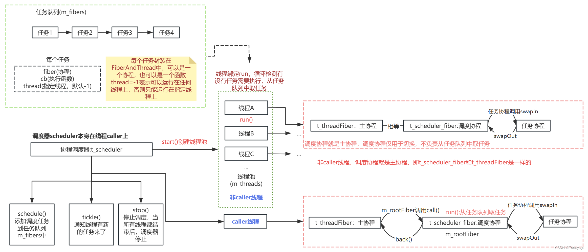
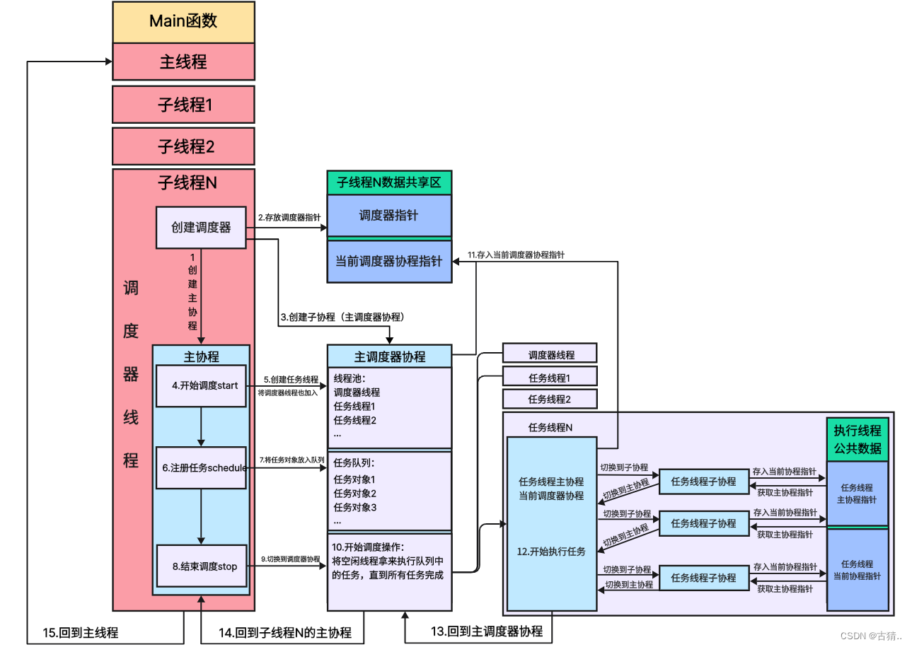
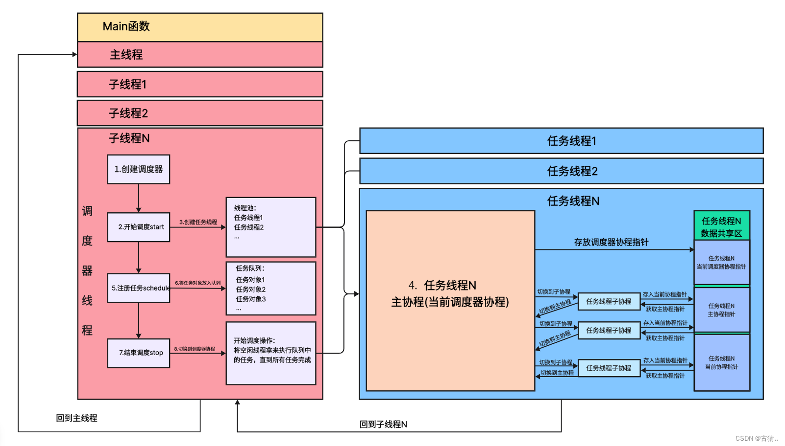

# Sylar_leo

---

---

- 学习参考
    - https://github.com/sylar-yin/sylar/tree/master
    - https://blog.csdn.net/qq_35099224/category_12613947.html
    - https://blog.beanljun.top/tags/C-C/
    - https://chatgpt.com/
- 相关知识点笔记
    - https://github.com/Lwaiz/sylar_leo/blob/master/Sylar_note.md


- 学习进度

 | 开发时间      | 模块                                        | 
 |-----------|-------------------------------------------|
 | 2025.1.6  | 日志系统 [Logger](#日志系统-logger)               |
 | 2025.1.15 | 配置系统 [Config](#配置系统-config)               |
 | 2025.2.5  | 线程模块 [Thread](#线程模块-thread)               |
 | 2025.2.9  | 协程模块 [Fiber](#协程模块-fiber)                 |
 | 2025.2.11 | 协程调度模块 [Scheduler](#协程调度模块-scheduler)     |
 | 2025.2.14 | IO协程调度模块 [IOManager](#IO协程调度模块-IOManager) |
 | 2025.2.16 | 定时器模块 [Timer](#定时器模块-timer)               |
 | 2025.2.21 | Hook模块 [Hook](#Hook模块-hook)               |
 | 2025.2.23 | 地址模块 [Address](#网络地址模块-address)           |
 | 2025.2.24 | 网络模块  [Socket](#网络模块-Socket)              |
 | 2025.2.   | 序列化模块 [ByteArray](#序列化模块-ByteArray)                |
---


# 开发环境

```powershell
wsl2 ---- Ubuntu-22.04

gcc (Ubuntu 11.4.0-1ubuntu1~22.04) 11.4.0

g++ (Ubuntu 11.4.0-1ubuntu1~22.04) 11.4.0

cmake version 3.22.1
```


---

# 日志系统 Logger

---

## 功能特点

1. **灵活的日志级别**：
- 支持多种日志级别：DEBUG、INFO、WARN、ERROR 和 FATAL。
- 可根据严重性过滤日志。

2. **基于流的日志记录**：
- 提供基于流语法的日志宏，例如：`SYLAR_LOG_DEBUG(logger) << "消息内容";`。

3. **格式化日志记录**：
- 支持类似 `printf` 风格的格式化日志宏，例如：`SYLAR_LOG_FMT_INFO(logger, "值: %d", value);`。

4. **可扩展的日志格式化**：
- 支持基于模式的日志格式化。
- 常用模式包括时间戳、线程 ID、日志级别、文件名和行号等。

5. **线程与协程支持**：
- 捕获线程与协程信息，增强调试与追踪能力。

6. **动态日志配置**：
- 可配置日志级别和输出位置。
- 支持将日志写入文件或标准输出。

---

## 架构
### 1. 核心类


#### LogLevel 类
**定义日志级别**

包含 UNKNOW, DEBUG, INFO, WARN, ERROR, FATAL共五个级别 

通过 ToString函数 和 FromString函数实现了日志级别和文本的相互转换
（具体实现使用了宏定义）

#### LogEvent 类
**日志事件类**

包含一条日志记录的信息，包含日志时间、线程信息、日志级别、内容、代码位置等内容

#### LogEventWrap 类

为 LogEvent 提供包装器，简化宏中日志事件的管理

#### LogFormatter 类
**日志格式器**
*  %m 消息
*  %p 日志级别
*  %r 累计毫秒数
*  %c 日志名称
*  %t 线程id
*  %n 换行
*  %d 时间
*  %f 文件名
*  %l 行号
*  %T 制表符
*  %F 协程id
*  %N 线程名称

**默认格式模板**
*     "%d{%Y-%m-%d %H:%M:%S}%T%t%T%N%T%F%T[%p]%T[%c]%T%f:%l%T%m%n"

format函数 返回格式化日志文本

#### FormatItem 类
* @brief 日志内容项格式化类
    *   每个 FormatItem 表示一个日志格式化标记的解析结果，例如 %m 或 %p
    *   继承 FormatItem，可以为不同的标记（如 %m 消息）自定义解析和格式化逻辑
**init 初始化函数**
解析日志格式化字符串模式（m_pattern）并将解析结果存储到一个vec中
* @example "%d{%Y-%m-%d %H:%M:%S} [%p] %c: %m%n"
  * %d 表示日期时间，%p 表示日志级别，%c 表示日志名称，%m 表示消息内容，%n 表示换行符
  * 遇到 %d：检测到 {%Y-%m-%d %H:%M:%S} 为参数，解析为 ("d", "{%Y-%m-%d %H:%M:%S}", 1)。
  * 遇到 [: 普通字符，解析为 ("[", "", 0)。
  * 遇到 %p：无参数，解析为 ("p", "", 1)。
  * 遇到 %c：无参数，解析为 ("c", "", 1)。
  * 遇到 %m：无参数，解析为 ("m", "", 1)。
  * 遇到 %n：无参数，解析为 ("n", "", 1)。

**init 函数具体实现**
1. 初始化 定义容器与变量
2. 遍历格式化模式 m_pattern
3. 格式化解析字符串部分
4. 根据解析结果更新 vec
5. 处理剩余普通字符串
6. 格式化项创建函数映射
7. 遍历 vec 生成格式化项

#### LogAppender 类
**日志输出目标类: 控制台 / 文件**


#### StdOutLogAppender 类
输出到控制台的Appender

#### FileLogAppender 类
输出到文件的Appender

#### Logger 类
**日志器**

### 2. **日志宏**

#### **基于流的日志记录**
```cpp
SYLAR_LOG_DEBUG(logger) << "调试信息";
SYLAR_LOG_INFO(logger) << "普通信息";
SYLAR_LOG_ERROR(logger) << "错误信息";
```

#### **格式化日志记录**
```cpp
SYLAR_LOG_FMT_DEBUG(logger, "值: %d", value);
SYLAR_LOG_FMT_INFO(logger, "用户: %s", username.c_str());
```

### 3. **Logger**
管理日志事件，并将其发送到适当的输出目标（如控制台、文件）。

---

## 设置与使用

### 1. **集成**
在项目中包含头文件：
```cpp
#include "sylar/log.h"
```

### 2. **创建 Logger**
```cpp
sylar::Logger::ptr logger = std::make_shared<sylar::Logger>();
logger->setLevel(sylar::LogLevel::DEBUG);
```

### 3. **记录日志**
基于流的日志记录：
```cpp
SYLAR_LOG_INFO(logger) << "应用启动";
```

格式化日志记录：
```cpp
SYLAR_LOG_FMT_ERROR(logger, "错误代码: %d", errorCode);
```

### 4. **自定义日志格式**
定义自定义的日志消息格式：
```cpp
logger->setFormatter("%d{%Y-%m-%d %H:%M:%S}%T%t%T[%p]%T[%c]%T%m%n");
```

---

## 示例

### 示例 1: 基础日志记录
```cpp
#include "sylar/log.h"

int main() {
    sylar::Logger::ptr logger = std::make_shared<sylar::Logger>();
    logger->setLevel(sylar::LogLevel::INFO);

    SYLAR_LOG_INFO(logger) << "这是普通信息。";
    SYLAR_LOG_ERROR(logger) << "这是错误信息。";

    return 0;
}
```

### 示例 2: 高级格式化
```cpp
#include "sylar/log.h"

int main() {
    sylar::Logger::ptr logger = std::make_shared<sylar::Logger>();
    logger->setFormatter("%d{%H:%M:%S} %p %m%n");

    SYLAR_LOG_WARN(logger) << "带有自定义格式的警告！";

    return 0;
}
```

---

---

# 配置系统 Config

---

## 功能特性
- **约定由于配置**:采用约定由于配置的思想。定义即可使用。不需要单独去解析。支持变更通知功能。使用YAML文件做为配置内容。
- **支持多种类型**：支持常见的基础类型和容器类型。
- **动态管理**：通过统一的接口动态获取和设置配置参数。
- **类型安全**：利用模板机制确保类型转换安全。
- **序列化与反序列化**：提供参数值与 YAML 格式字符串之间的互相转换。
- **日志支持**：对于异常情况提供详细的日志记录。

## 系统架构
- **ConfigVarBase**

  ```配置变量的基类，其主要是虚方法，定义了配置项中共有的成员和方法，其具体实验由基类的具体子类负责实现。其中重点是toString()方法和fromString()方法，其分别负责将配置信息转化字符串和从字符串中解析出配置。```
- **ConfigVar**

  ```配置参数模板子类，并且是模板类，其具有三个模板参数，分别是配置项类型模板T、仿函数FromStr和仿函数Tostr。ConfigVar类在ConfigVarBase的基础上，增加了AddListener方法和delListener等方法，用于增删配置变更回调函数。```
- **Config**

  ```ConfigVar的管理类，其提供便捷的方法创建、访问ConfigVar，其主要方法未Lookup方法，可根据配置的名称查询配置项，如果查询时未找到对应的配置则新建一个配置项。其还有从配置文件中读取配置、遍历所有配置项等方法。其中，Config中的方法都是static方法，确保全局只有一个实例。```

### 核心组件

#### 1. `ConfigVarBase`
**作用**：配置变量的基类，定义了所有配置项的基本属性和接口。
- **主要成员变量**：
  - `m_name`：配置参数的名称。
  - `m_description`：配置参数的描述。
- **主要接口**：
  - `toString()`：将配置参数值序列化为字符串。
  - `fromString()`：从字符串反序列化为配置参数值。

#### 2. `ConfigVar`
**作用**：配置参数模板子类，用于存储具体类型的配置变量，继承自 `ConfigVarBase`。
- **模板参数**：
  - `T`：配置参数的类型。
  - `FromStr`：从字符串转换为 `T` 类型的仿函数。
  - `ToStr`：从 `T` 类型转换为字符串的仿函数。
  - `addListener`、`delListener`、`clearListener`等方法用于设置配置值改变时的回调函数
- **主要功能**：
  - 保存和操作具体类型的配置变量值。
  - 利用模板特化支持容器类型。

#### 3. `LexicalCast`
**作用**：通用的类型转换工具。
- **主要功能**：
  - 基本类型之间的转换（如 `int` 转 `std::string`）。
  - 支持容器类型与 YAML 字符串之间的相互转换。
- **特化实现**：支持 vector,list,set,unordered_set,map,unordered_map
  - `LexicalCast<std::string, std::vector<T>>`：从 YAML 字符串转换为 `std::vector<T>`。
  - `LexicalCast<std::vector<T>, std::string>`：将 `std::vector<T>` 转换为 YAML 字符串。
  - `LexicalCast<std::list<T>, std::string>`：将 `std::list<T>` 转换为 YAML 字符串。 
  - `LexicalCast<std::string, std::set<T>>`：将 YAML 字符串转换为 `std::set<T>`。 
  - `LexicalCast<std::set<T>, std::string>`：将 `std::set<T>` 转换为 YAML 字符串。 
  - `LexicalCast<std::string, std::unordered_set<T>>`：将 YAML 字符串转换为 `std::unordered_set<T>`。 
  - `LexicalCast<std::unordered_set<T>, std::string>`：将 `std::unordered_set<T>` 转换为 YAML 字符串。 
  - `LexicalCast<std::string, std::map<std::string, T>>`：将 YAML 字符串转换为 `std::map<std::string, T>`。 
  - `LexicalCast<std::map<std::string, T>, std::string>`：将 `std::map<std::string, T>` 转换为 YAML 字符串。 
  - `LexicalCast<std::string, std::unordered_map<std::string, T>>`：将 YAML 字符串转换为 `std::unordered_map<std::string, T>`。 
  - `LexicalCast<std::unordered_map<std::string, T>, std::string>`：将 `std::unordered_map<std::string, T>` 转换为 YAML 字符串。
#### 4. `Config`
**作用**：配置管理类，提供全局统一的配置操作接口。
- **主要成员变量**：
  - `s_datas`：保存所有配置参数的映射表（键为参数名，值为配置变量指针）。
  - 提供了`Lookup`方法来根据配置名称查找配置项（并返回指定类型的配置项），
      - 如果找不到则可以创建新的配置项。
  - `LoadFromYaml`方法用于从YAML节点加载配置
- **主要功能**：
  - 动态查找和创建配置参数。
  - 从 YAML 文件加载配置。

### 配置加载流程
1. **定义配置变量**：使用 `Config::Lookup` 接口定义配置项，并设置默认值和描述。
2. **加载 YAML 文件**：通过 `Config::LoadFromYaml` 接口加载 YAML 格式的配置文件。
3. **访问配置参数**：通过 `Config::LookupBase` 或特定类型的 `Config::Lookup` 方法访问配置参数。
4. **动态修改配置参数**：在运行时修改配置值，通过 `toString` 和 `fromString` 实现参数的序列化与反序列化。

### 配置参数生命周期
1. **创建**：配置参数首次通过 `Config::Lookup` 定义并添加到全局映射表。
2. **管理**：所有配置项存储于 `Config` 类的 `s_datas` 静态变量中，统一管理。
3. **销毁**：程序退出时自动释放资源。

## 示例代码
### 定义配置参数
```cpp
#include "config.h"

// 定义一个整型配置变量
sylar::ConfigVar<int>::ptr g_int_config =
    sylar::Config::Lookup<int>("system.port", 8080, "Server port");

// 定义一个字符串向量配置变量
sylar::ConfigVar<std::vector<std::string>>::ptr g_vec_config =
    sylar::Config::Lookup<std::vector<std::string>>("system.hosts", {"127.0.0.1"}, "Server hosts");
```

### 加载配置文件
```cpp
#include "yaml-cpp/yaml.h"
#include "config.h"

void LoadConfig() {
    YAML::Node root = YAML::LoadFile("config.yml");
    sylar::Config::LoadFromYaml(root);
}
```

### 访问配置参数
```cpp
int port = g_int_config->getValue();
std::vector<std::string> hosts = g_vec_config->getValue();
```

### 动态修改参数
```cpp
g_int_config->setValue(9090);
std::cout << g_int_config->toString() << std::endl;
```

## 日志与异常处理
- 在配置加载和类型转换失败时，系统会记录详细的错误日志，便于调试。
- 配置参数的名称需要符合正则表达式 `[a-z0-9_.]+`，否则会抛出异常。

## 依赖
- `boost`：用于类型转换。
- `yaml-cpp`：解析 YAML 配置文件。

## 配置系统整合日志系统

---

---
# 线程模块 Thread

---

## 功能特性

该模块提供了一个 **线程管理和同步机制** 的实现。它包括以下主要功能：
- 线程的创建与管理（Thread 类）
- 各种同步原语，包括互斥锁、读写锁、信号量等（Mutex、RWMutex、Semaphore 等类）
- 线程同步的模板实现（ScopedLockImpl、ReadScopedLockImpl、WriteScopedLockImpl 等类）

这些功能实现了多线程并发控制与线程间资源共享时的同步操作。

https://blog.beanljun.top/sylar/thread/

## 核心组件

```
Thread
├── Thread        // 线程类，管理线程创建、启动、终止    基于 pthread 实现
├── Mutex         // 互斥量类，防止线程间资源竞争       基于 pthread_mutex_t 实现
├── RWMutex       // 读写锁类，优化读操作的性能         基于 pthread_rwlock_t 实现
├── Semaphore     // 信号量类，控制并发数              基于 sem_t 实现
├── Spinlock      // 自旋锁类，针对高并发低延迟场景     基于pthread_spinlock_t实现
└── CASLock       // 基于原子操作的锁                 基于std::atomic_flag实现
```

### 1. Thread 类
Thread 类是一个封装线程操作的类，主要用于创建和管理线程。它提供了对线程执行、名称、ID等信息的访问，以及等待线程结束的功能。该类使用了 pthread 库来实现线程的创建和管理。

**线程构造和执行：**

```
通过传入一个线程执行回调函数（cb）和线程名称（name）来创建线程。
线程启动时，会执行传入的回调函数 cb。 
```

**线程信息访问：**

- getId()：获取线程的 ID（pid_t 类型）。
- getName()：获取线程的名称。

**等待线程执行完毕：**

- join()：等待线程执行完毕，类似于 pthread_join()，确保线程退出。

**静态线程操作：**

- GetThis()：获取当前线程的指针。
- GetName() 和 SetName()：获取和设置当前线程的名称。

**线程入口函数：**

- run()：作为线程的入口函数，调用传入的回调函数来执行线程任务

### 2. Semaphore 类
   Semaphore 是 **信号量类** ，通常用于控制对共享资源的并发访问。在这个类中：

- wait() 方法会使线程进入等待状态（即等待信号量）。
- notify() 方法会释放信号量，通知一个等待的线程。
信号量是通过 sem_t 类型实现的，sem_t 是 POSIX 标准定义的信号量类型，通常用于进程间或线程间的同步。

### 3. ScopedLockImpl 模板类
   ScopedLockImpl 是一个局部锁（RAII 锁）模板类，在作用域内自动加锁，离开作用域时自动解锁。它有以下功能：

- 在构造函数中调用 m_mutex.lock() 来加锁。
- 在析构函数中调用 unlock() 来解锁，确保资源释放。

### 4. ReadScopedLockImpl 模板类
   ReadScopedLockImpl 是一个局部读锁模板类，用于读写锁（pthread_rwlock_t）。它的功能与 ScopedLockImpl 类似，只不过是加读锁而不是普通的互斥锁：

- 在构造函数中调用 m_mutex.rdlock() 来加读锁。
- 在析构函数中调用 unlock() 来解锁。

### 5.WriteScopedLockImpl 模板类
   WriteScopedLockImpl 是一个局部写锁模板类，类似于 ReadScopedLockImpl，但是用于加写锁：

- 在构造函数中调用 m_mutex.wrlock() 来加写锁。
- 在析构函数中调用 unlock() 来解锁。

### 6. Mutex 类
   Mutex 类是一个基本的 **互斥锁** 实现，内部使用 pthread_mutex_t 来加锁和解锁：

    互斥锁是一种同步原语，用于控制对共享资源的访问。互斥锁可以确保在任何时候只有一个线程
    可以访问共享资源，从而避免竞争条件和数据竞争。

- lock()：调用 pthread_mutex_lock() 来加锁。
- unlock()：调用 pthread_mutex_unlock() 来解锁。
Mutex 类同时定义了一个 Lock 类型，表示局部锁。

### 7. NullMutex 类
   NullMutex 类是一个空锁实现，通常用于调试，避免在某些情况下加锁的开销：

- lock() 和 unlock() 方法为空实现，不做任何操作。

### 8. RWMutex 类
   RWMutex 是一个读写锁实现，**用于支持多个线程并发读取，或者一个线程独占写入**：

- rdlock()：加读锁，允许多个线程并发读取。
- wrlock()：加写锁，独占资源。
- unlock()：释放锁。

RWMutex 类同时定义了 ReadLock 和 WriteLock 类型，分别表示局部的读锁和写锁。

### 9. NullRWMutex（空读写锁）
类似 NullMutex，但用于读写锁的场景。

- rdlock()、wrlock() 和 unlock() 都为空实现。

### 10. Spinlock（自旋锁）
自旋锁是一种高效的锁机制，当线程无法获取锁时会反复检查锁是否可用，而不是将自己挂起。

    与mutex不同，自旋锁不会使线程进入睡眠状态，而是在获取锁时进行忙等待，直到锁可用。
    当锁被释放时，等待获取锁的线程将立即获取锁，从而避免了线程进入和退出睡眠状态的额外开销。

- lock()：尝试获取自旋锁，若无法获取则反复自旋。
- unlock()：释放自旋锁， 可以使其他线程获取相应的锁来访问共享资源。

### 11. CASLock（原子锁） 
使用原子操作实现的 **原子锁** ，通常用于高并发场景，避免线程上下文切换的开销。

    原子操作是一种不可中断的操作，它要么全部执行，要么全部不执行，不会出现部分执行的情况。

- lock()：使用原子操作尝试获取锁，直到获取成功。
- unlock()：通过原子操作释放锁。

---

---

# 协程模块 Fiber

## 功能特性

---
基于 C++ 的协程（Fiber）模块，旨在提供轻量级的线程切换支持。
该模块允许在多线程环境中高效地创建和调度协程，
能够通过 ucontext 实现上下文切换，支持协程的创建、执行、暂停以及销毁。

- 轻量级协程管理：每个协程的栈大小和运行时信息都是独立管理的，减少线程切换的开销。
- 灵活的协程调度：支持协程的创建、状态切换以及调度。 
- 栈内存管理：内存栈是通过 malloc 和 free 管理的，支持灵活的协程栈大小。 
- 支持主协程与子协程：可以创建和管理多个协程，支持主协程与子协程之间的切换。 
- 协程状态管理：提供多种状态（如 INIT、HOLD、EXEC、TERM）来管理协程的生命周期。
---

## 核心组件



### 协程状态 (State)
   ```
   INIT: 初始化状态
   HOLD: 暂停状态
   EXEC: 执行中状态
   TERM: 结束状态
   READY: 可执行状态
   EXCEPT: 异常状态
   ```
### Fiber 类
#### 构造函数：

- `Fiber()`: 创建主协程。
- `Fiber(std::function<void()> cb, size_t stacksize = 0, bool use_caller = false)`: 创建子协程，传入执行的回调函数、栈大小、是否使用主协程进行调度。
#### 析构函数：

- `~Fiber()`: 协程析构时会释放栈内存并更新协程计数。
#### 成员函数：

- `reset(std::function<void()> cb)`: 重置协程的执行函数。
- `swapIn()`: 将当前协程切换到前台执行。
- `swapOut()`: 将当前协程切换到后台。 
- `call()`: 将当前协程切换到执行状态。 
- `back()`: 将当前协程切换到后台并返回主协程。

#### 静态函数：

- `SetThis(Fiber* f)`: 设置当前线程的运行协程。
- `GetThis()`: 返回当前协程。
- `YiledToReady()`: 将当前协程切换到后台，并设置为 READY 状态。 
- `YiledToHold()`: 将当前协程切换到后台，并设置为 HOLD 状态。 
- `TotalFibers()`: 返回当前协程的总数。 
- `MainFunc()`: 协程执行的入口函数。
- `CallMainFunc()`: 调度协程执行的函数。

### 示例
```cpp
#include "../sylar/sylar.h"

sylar::Logger::ptr g_logger = SYLAR_LOG_ROOT();

void run_in_fiber() {
    SYLAR_LOG_INFO(g_logger) << "run_in_fiber begin";
    sylar::Fiber::YiledToHold();
    SYLAR_LOG_INFO(g_logger) << "run_in_fiber end";
    sylar::Fiber::YiledToHold();

}

void test_fiber() {
    SYLAR_LOG_INFO(g_logger) << "main begin -1";
    {
        sylar::Fiber::GetThis();
        SYLAR_LOG_INFO(g_logger) << "main begin";
        sylar::Fiber::ptr fiber(new sylar::Fiber(run_in_fiber));
        fiber->swapIn();
        SYLAR_LOG_INFO(g_logger) << "main after swapIn";
        fiber->swapIn();
        SYLAR_LOG_INFO(g_logger) << "main after end";
        fiber->swapIn();
    }
    SYLAR_LOG_INFO(g_logger) << "main after end 2";
}

int main(int argc, char** argv) {
    sylar::Thread::SetName("main_thread ");

    std::vector<sylar::Thread::ptr> thrs;
    for(int i = 0; i < 3; ++i){
        thrs.push_back(sylar::Thread::ptr(
                new sylar::Thread(&test_fiber, "name_" + std::to_string(i))));
    }
    for(auto i : thrs){
        i->join();
    }

    return 0;
}
```
**测试结果**
```shell
2025-02-10 21:20:41	22351	name_0	0	[INFO]	[root]	</home/leo/CppProgram/sylar/tests/test_fiber.cpp:25>	main begin -1
2025-02-10 21:20:41	22353	name_2	0	[INFO]	[root]	</home/leo/CppProgram/sylar/tests/test_fiber.cpp:25>	main begin -1
2025-02-10 21:20:41	22352	name_1	0	[INFO]	[root]	</home/leo/CppProgram/sylar/tests/test_fiber.cpp:25>	main begin -1
2025-02-10 21:20:41	22351	name_0	0	[DEBUG]	[system]	</home/leo/CppProgram/sylar/sylar/fiber.cpp:94>	Fiber::Fiber main
2025-02-10 21:20:41	22353	name_2	0	[DEBUG]	[system]	</home/leo/CppProgram/sylar/sylar/fiber.cpp:94>	Fiber::Fiber main
2025-02-10 21:20:41	22351	name_0	0	[INFO]	[root]	</home/leo/CppProgram/sylar/tests/test_fiber.cpp:28>	main begin
2025-02-10 21:20:41	22353	name_2	0	[INFO]	[root]	</home/leo/CppProgram/sylar/tests/test_fiber.cpp:28>	main begin
2025-02-10 21:20:41	22352	name_1	0	[DEBUG]	[system]	</home/leo/CppProgram/sylar/sylar/fiber.cpp:94>	Fiber::Fiber main
2025-02-10 21:20:41	22353	name_2	0	[DEBUG]	[system]	</home/leo/CppProgram/sylar/sylar/fiber.cpp:127>	Fiber::Fiber id=2
2025-02-10 21:20:41	22352	name_1	0	[INFO]	[root]	</home/leo/CppProgram/sylar/tests/test_fiber.cpp:28>	main begin
2025-02-10 21:20:41	22353	name_2	2	[INFO]	[root]	</home/leo/CppProgram/sylar/tests/test_fiber.cpp:17>	run_in_fiber begin
2025-02-10 21:20:41	22351	name_0	0	[DEBUG]	[system]	</home/leo/CppProgram/sylar/sylar/fiber.cpp:127>	Fiber::Fiber id=1
2025-02-10 21:20:41	22353	name_2	0	[INFO]	[root]	</home/leo/CppProgram/sylar/tests/test_fiber.cpp:31>	main after swapIn
2025-02-10 21:20:41	22352	name_1	0	[DEBUG]	[system]	</home/leo/CppProgram/sylar/sylar/fiber.cpp:127>	Fiber::Fiber id=3
2025-02-10 21:20:41	22351	name_0	1	[INFO]	[root]	</home/leo/CppProgram/sylar/tests/test_fiber.cpp:17>	run_in_fiber begin
2025-02-10 21:20:41	22353	name_2	2	[INFO]	[root]	</home/leo/CppProgram/sylar/tests/test_fiber.cpp:19>	run_in_fiber end
2025-02-10 21:20:41	22351	name_0	0	[INFO]	[root]	</home/leo/CppProgram/sylar/tests/test_fiber.cpp:31>	main after swapIn
2025-02-10 21:20:41	22352	name_1	3	[INFO]	[root]	</home/leo/CppProgram/sylar/tests/test_fiber.cpp:17>	run_in_fiber begin
2025-02-10 21:20:41	22351	name_0	1	[INFO]	[root]	</home/leo/CppProgram/sylar/tests/test_fiber.cpp:19>	run_in_fiber end
2025-02-10 21:20:41	22352	name_1	0	[INFO]	[root]	</home/leo/CppProgram/sylar/tests/test_fiber.cpp:31>	main after swapIn
2025-02-10 21:20:41	22351	name_0	0	[INFO]	[root]	</home/leo/CppProgram/sylar/tests/test_fiber.cpp:33>	main after end
2025-02-10 21:20:41	22352	name_1	3	[INFO]	[root]	</home/leo/CppProgram/sylar/tests/test_fiber.cpp:19>	run_in_fiber end
2025-02-10 21:20:41	22353	name_2	0	[INFO]	[root]	</home/leo/CppProgram/sylar/tests/test_fiber.cpp:33>	main after end
2025-02-10 21:20:41	22352	name_1	0	[INFO]	[root]	</home/leo/CppProgram/sylar/tests/test_fiber.cpp:33>	main after end
2025-02-10 21:20:41	22351	name_0	0	[DEBUG]	[system]	</home/leo/CppProgram/sylar/sylar/fiber.cpp:153>	Fiber::~Fiber id=1 total=5
2025-02-10 21:20:41	22352	name_1	0	[DEBUG]	[system]	</home/leo/CppProgram/sylar/sylar/fiber.cpp:153>	Fiber::~Fiber id=3 total=3
2025-02-10 21:20:41	22351	name_0	0	[INFO]	[root]	</home/leo/CppProgram/sylar/tests/test_fiber.cpp:36>	main after end 2
2025-02-10 21:20:41	22352	name_1	0	[INFO]	[root]	</home/leo/CppProgram/sylar/tests/test_fiber.cpp:36>	main after end 2
2025-02-10 21:20:41	22353	name_2	0	[DEBUG]	[system]	</home/leo/CppProgram/sylar/sylar/fiber.cpp:153>	Fiber::~Fiber id=2 total=4
2025-02-10 21:20:41	22351	name_0	0	[DEBUG]	[system]	</home/leo/CppProgram/sylar/sylar/fiber.cpp:153>	Fiber::~Fiber id=0 total=2
2025-02-10 21:20:41	22353	name_2	0	[INFO]	[root]	</home/leo/CppProgram/sylar/tests/test_fiber.cpp:36>	main after end 2
2025-02-10 21:20:41	22352	name_1	0	[DEBUG]	[system]	</home/leo/CppProgram/sylar/sylar/fiber.cpp:153>	Fiber::~Fiber id=0 total=1
2025-02-10 21:20:41	22353	name_2	0	[DEBUG]	[system]	</home/leo/CppProgram/sylar/sylar/fiber.cpp:153>	Fiber::~Fiber id=0 total=0
```

---

---

# 协程调度模块 Scheduler

## 设计特点

1. **协程调度**  
   类中提供了协程调度的能力，并能够根据任务类型（协程或回调函数）将其调度到线程池中的线程执行。

2. **线程池管理**  
   通过线程池来管理多个协程执行的线程。可以动态调整空闲线程和活动线程的数量。

3. **无锁调度**  
   为了提高性能，`scheduleNoLock` 采用了无锁操作，减少锁的竞争。

4. **空闲协程处理**  
   当没有任务需要执行时，调度器可以执行一个“空闲”协程来保持线程池的活跃。


## 核心逻辑



---

* **use_caller = true**  
  * 在主线程上创建调度协程，其中main主线程上有 1.main的主协程，2.调度协程，3.任务子协程

* **use_caller = false** 
  * 新建一个调度线程，调度线程的主协程为调度协程，调度线程上有 1.调度协程，2.任务子协程

---

## 核心组件

### Scheduler 协程调度器类

`Scheduler` 类是一个协程调度器的实现，主要功能是管理并调度多个协程任务的执行。它封装了协程的调度逻辑和线程池的管理，支持协程在线程池中切换。具体来说，类中包含以下几个主要部分：

#### 1. 构造函数与析构函数

- `Scheduler(size_t threads = 1, bool use_caller = true, const std::string& name = "")`  
  构造一个调度器，可以指定线程数量、是否使用当前调用线程作为根线程以及调度器的名称。

- `virtual ~Scheduler()`  
  虚析构函数，用于释放资源。

#### 2. 调度功能

- `start()`  
  启动调度器，开始协程调度。
```
    1. 检查是否已经在停止：
      如果正在停止 (m_stopping 为 true)，则直接返回，不执行后续操作。

    2. 启动线程池：
     - 创建一个大小为 m_threadCount 的线程池。
     - 为每个线程创建一个新的 Thread 对象，并通过 std::bind 将 Scheduler::run 作为线程的执行入口函数。
     - 每个线程会执行 Scheduler::run 方法，从而开始协程调度工作。

    3. 线程信息记录：
      将每个线程的 ID 记录在 m_threadIds 中。
```

- `stop()`  
  停止调度器。
```
    1. 设置自动停止标志：
    设置 m_autoStop 为 true，表示调度器在适当的时机会自动停止。
    
    2. 检查根协程状态：
    如果根协程存在，且线程数为 0，并且根协程已经结束或正在初始化，执行停止操作。
    
    3. 唤醒所有线程：
    唤醒所有调度线程，通知它们停止执行。
    
    4. 等待线程退出：
    将所有线程的 shared_ptr 存储在 thrs 中，接着调用 join() 等待每个线程退出。
```

- `schedule(FiberOrCb fc, int thread = -1)`  
  该函数将协程或回调函数 `fc` 调度到执行队列中，`thread` 参数指定在哪个线程执行，-1 表示可以在任意线程执行。此函数还支持批量调度。

- `scheduleNoLock(FiberOrCb fc, int thread)`  
  执行无锁调度，将一个协程或者回调函数加入执行队列。

#### 3. 协程与线程的调度

- `FiberAndThread`  
  这是一个结构体，用于保存协程（`Fiber`）、回调函数（`cb`）以及指定线程的 ID（`thread`）。它有多个构造函数，用于支持不同的初始化方式。

- `tickle()`  
  通知调度器有任务需要执行。

- `run()`  
  执行调度任务。
```
    1. 设置当前调度器为全局调度器：
       setThis() 设置当前调度器对象为全局的 t_scheduler。
    2. 处理调度线程：
    - 如果当前线程不是根线程，设置当前线程的协程为 t_scheduler_fiber。
    - 创建一个空闲协程 idle_fiber，当没有任务时执行该协程。
    3. 循环调度任务：
    - 无限循环中从 m_fibers 队列中取出待执行的协程。
    - 如果队列为空，则执行空闲协程。
    - 如果有回调函数，则创建回调协程并执行。
    4. 协程执行状态管理：
       根据协程的状态（如 READY、TERM、EXCEPT 等）决定是否继续调度或退出协程。
```

- `idle()`  
  当没有任务可调度时执行的空闲协程。

#### 4. 协程调度状态

- `stopping()`  
  检查调度器是否可以停止。

- `setThis()`  
  设置当前调度器。

- `hasIdleThreads()`  
  检查是否有空闲线程。

#### 5. 成员变量

- `m_threads`  
  线程池中的所有线程。

- `m_fibers`  
  存储待执行的协程队列。

- `m_rootFiber`  
  根协程，当 `use_caller` 为 true 时，当前调用线程作为根协程。

- `m_name`  
  协程调度器的名称。

- `m_threadIds`  
  线程 ID 数组，表示每个线程执行的协程。

- `m_activeThreadCount`  
  正在执行任务的线程数量。

- `m_idleThreadCount`  
  空闲线程数量。

- `m_stopping`  
  标志调度器是否停止。

- `m_autoStop`  
  是否自动停止。

- `m_rootThread`  
  根线程 ID。

#### 6. 线程池管理

通过 `m_threads` 存储的线程池来管理多线程，协程调度是基于线程池的。每个线程可以执行多个协程任务。

### 示例

```cpp
int main(int argc, char** argv) {
    SYLAR_LOG_INFO(g_logger) << "main";
    // 创建一个调度器，true 使用主线程创建调度协程; false 新建调度线程
    sylar::Scheduler sc(2, false, "test");
    // 启动调度器
    sc.start();
    sleep(2);
    SYLAR_LOG_INFO(g_logger) << "schedule";
    sc.schedule(&test_scheduler);
    // 停止调度器
    sc.stop();
    SYLAR_LOG_INFO(g_logger) << "over";
    return 0;
}
```

---

---

# IO协程调度模块 IOManager

---

## 设计概述
`IOManager` 使用 Epoll 提供的高效 I/O 多路复用机制，允许程序在多个文件描述符（如 socket）上监听 I/O 事件。当 I/O 事件发生时，相应的回调函数或协程会被调度执行。每个文件描述符关联一个 `FdContext`，并为每种事件（读、写）维护一个事件上下文，记录相关的协程和回调函数。

通过协程调度机制，`IOManager` 可以处理大量的并发 I/O 操作，而不会阻塞主线程，提供高效的异步 I/O 支持。

---
## 核心机制

`IOManager` 的核心机制是通过 Epoll 实现 I/O 多路复用。当 I/O 事件发生时，Epoll 会通知 `IOManager`，然后 `IOManager` 根据事件类型执行相应的回调函数或协程。它将每个文件描述符的事件与一个事件上下文（`FdContext`）关联起来，并通过协程调度来处理这些事件。

1. 事件的注册和处理：
- `addEvent`：向 Epoll 注册事件，将文件描述符与事件（如读、写）及其回调函数关联。
- `delEvent` 和 `cancleEvent`：用于取消或删除已注册的事件，并触发相应的回调。

2. Epoll 事件的通知与调度：
- 当事件发生时，`IOManager` 会触发相应的回调函数或协程，处理具体的 I/O 操作。
- 通过协程调度（`Fiber`），避免阻塞操作，提升并发性能。

3. 调度和协程切换：
- 每当 I/O 事件发生时，会从调度队列中取出相应的协程，并执行它。
- 协程的状态通过 Fiber 对象管理，根据事件的完成情况决定是否继续执行或切换到其他任务。

## 主要结构和方法解析

### 1. **`Event` 枚举**
`Event` 枚举定义了支持的事件类型：
- `NONE`：无事件
- `READ`：读事件（EPOLLIN）
- `WRITE`：写事件（EPOLLOUT）

### 2. **`FdContext` 类**
`FdContext` 类用于管理每个文件描述符（如 socket）的事件上下文。它包含：
- **`fd`**：文件描述符
- **`events`**：当前事件类型
- **`read` 和 `write`**：分别表示读事件和写事件的上下文。

#### `EventContext` 内部类
`EventContext` 用于描述与某个事件（读或写）相关的调度器、协程（Fiber）和回调函数：
- **`scheduler`**：事件执行的调度器
- **`fiber`**：事件关联的协程
- **`cb`**：事件的回调函数

#### 方法：
- **`getContext(Event event)`**：根据事件类型（读或写）返回对应的事件上下文。
- **`resetContext(EventContext& ctx)`**：重置事件上下文。
- **`triggerEvent(Event event)`**：触发事件并执行回调。

### 3. **`IOManager` 类**
`IOManager` 类继承自 `Scheduler`，用于管理与文件描述符相关的 I/O 事件的调度。它通过 Epoll 提供的事件机制实现异步 I/O 操作。

#### 构造函数：
- `IOManager(size_t threads = 1, bool use_caller = true, const std::string& name = "")`：初始化调度器，设置线程数和调度器名称。

#### 主要方法：
- **`addEvent(int fd, Event event, std::function<void()> cb = nullptr)`**：添加事件，指定文件描述符、事件类型和回调函数。
- **`delEvent(int fd, Event event)`**：删除指定文件描述符的事件，不会触发回调。
- **`cancleEvent(int fd, Event event)`**：取消指定事件，触发回调。
- **`cancleAll(int fd)`**：取消所有与文件描述符相关的事件。
- **`GetThis()`**：返回当前的 IOManager 实例。

#### 保护方法：
- **`tickle()`**：覆盖 `Scheduler` 中的 `tickle()` 方法，用于唤醒调度器。
- **`stopping()`**：覆盖 `Scheduler` 中的 `stopping()` 方法，检查调度器是否在停止过程中。
- **`idle()`**：覆盖 `Scheduler` 中的 `idle()` 方法，处理空闲协程。

#### 私有方法：
- **`contextResize(size_t size)`**：调整 socket 事件上下文容器的大小。

### 4. **成员变量**
- **`m_epfd`**：epoll 文件描述符。
- **`m_tickleFds`**：用于唤醒调度器的 pipe 文件描述符，`fd[0]` 读端，`fd[1]` 写端。
- **`m_pendingEventCount`**：当前待处理的事件数量。
- **`m_mutex`**：用于访问共享资源的读写锁。
- **`m_fdContexts`**：存储每个文件描述符的事件上下文。

---

---

# 定时器模块 Timer

## **设计与功能**

### **定时器管理**
`TimerManager` 类维护一个按执行时间排序的定时器集合。通过 `addTimer` 和 `addConditionTimer` 方法，用户可以方便地添加定时器。条件定时器支持在满足某个条件时执行。

### **循环与单次定时器**
每个定时器可以是单次定时器或循环定时器。循环定时器在执行后会重新设置执行时间，从而实现定时器的重复执行。

### **定时器精确控制**
每个定时器都有一个精确的执行时间戳（`m_next`），确保定时器的执行时间是准确的。

### **定时器回调**
每个定时器都关联一个回调函数，定时器到期时会触发该回调。

### **时间滚动检测**
`detectClockRollover` 方法检测服务器时间是否被修改。如果时间回退，将进行相应的处理。

### **线程安全**
使用 `RWMutex` 确保定时器集合的访问是线程安全的。

---

## 1. **Timer 类**

### **成员变量**
- `m_recurring`：是否为循环定时器。
- `m_ms`：定时器的执行间隔时间（单位：毫秒）。
- `m_next`：定时器的执行时间戳（即精确的执行时间）。
- `m_cb`：定时器的回调函数。
- `m_manager`：定时器的管理器，指向 `TimerManager`。

### **成员函数**
- `cancle()`：取消定时器（可能是拼写错误，应为 `cancel()`）。
- `refresh()`：刷新定时器的执行时间。
- `reset(uint64_t ms, bool from_now)`：重置定时器的时间，接收新的执行间隔时间（毫秒）和是否从当前时间开始计算。
- 构造函数：
  - `Timer(uint64_t ms, std::function<void()> cb, bool recurring, TimerManager* manager)`：构造定时器。
  - `Timer(uint64_t next)`：构造定时器，接收执行时间戳。

### **内部结构**
- `Comparator`：定时器的比较仿函数，按执行时间排序定时器。

---

## 2. **TimerManager 类**

### **成员变量**
- `m_mutex`：读写锁类型，保护定时器的并发访问。
- `m_timers`：存储定时器的 `std::set`，按定时器的执行时间排序。
- `m_tickled`：标志是否触发 `onTimerInsertedAtFront()` 回调函数。
- `m_previouseTime`：上次执行定时器的时间，用于检测时间滚动。

### **成员函数**
- `addTimer(uint64_t ms, std::function<void()> cb, bool recurring = false)`：添加定时器，接收间隔时间、回调函数和是否循环的参数。
- `addConditionTimer(uint64_t ms, std::function<void()> cb, std::weak_ptr<void> weak_cond, bool recurring = false)`：添加条件定时器，接收间隔时间、回调函数、条件和是否循环的参数。
- `getNextTimer()`：获取距离下一个定时器执行的间隔时间。
- `listExpiredCb(std::vector<std::function<void()>>& cbs)`：获取已过期的定时器回调函数。
- `hasTimer()`：检查是否有定时器存在。

### **纯虚函数**
- `onTimerInsertedAtFront()`：当新的定时器插入到定时器队列的前端时触发。

### **内部函数**
- `addTimer(Timer::ptr val, RWMutexType::WriteLock& lock)`：将定时器添加到 `m_timers` 集合中，并加锁保护。

---

---

# Hook模块 hook

## hook设计

sylar的hook功能是以线程为单位的，可以自由设置当前线程是否使用hook。
默认情况下，协程调度器的调度线程会开启hook，而其他线程则不会开启。
对以下和函数进行了hook，并且只对socket fd进行了hook，
如果操作的不是socket fd，那会直接调用系统原本的API，而不是hook之后的API

sylar还增加了一个connect_with_timeout接口用于实现带超时的connect。
为了管理所有的socket fd，sylar设计了一个FdManager类来记录所有分配过的fd的上下文，
这是一个单例类，每个socket fd上下文记录了当前fd的读写超时，是否设置非阻塞等信息。

一共有三类接口需要hook，如下：

### sleep延时系列接口
    包括sleep/usleep/nanosleep。对于这些接口的hook，只需要给IO协程调度器注册一个定时事件，
    在定时事件触发后再继续执行当前协程即可。当前协程在注册完定时事件后即可yield让出执行权。

### socket IO系列接口
    包括read/write/recv/send...等，connect及accept也可以归到这类接口中。
    这类接口的hook首先需要判断操作的fd是否是socket fd，以及用户是否显式地对该fd设置过非阻塞模式，
    如果不是socket fd或是用户显式设置过非阻塞模式，那么就不需要hook了，直接调用操作系统的IO接口即可。
    如果需要hook，那么首先在IO协程调度器上注册对应的读写事件，等事件发生后再继续执行当前协程。当前协程在注册完IO事件即可yield让出执行权。

### socket/fcntl/ioctl/close等接口
    这类接口主要处理的是边缘情况，比如分配fd上下文，处理超时及用户显式设置非阻塞问题。

## 支持函数
支持的函数
以下是 Sylar Hook 库支持的部分系统调用及其自定义实现：

### 1. 时间相关
- `sleep`：休眠指定的秒数。

- `usleep`：休眠指定的微秒数。

- `nanosleep`：休眠指定的纳秒数。

### 2. 套接字相关
- `socket`：创建一个套接字。

- `connect`：连接到远程服务器。

- `accept`：接受客户端连接。

- `close`：关闭文件描述符。

### 3. 读取相关
- `read`：从文件描述符读取数据。

- `readv`：从文件描述符读取数据到多个缓冲区。

- `recv`：从套接字接收数据。

- `recvfrom`：从套接字接收数据并获取发送方地址。

- `recvmsg`：从套接字接收数据并支持复杂控制选项。

### 4. 写入相关
- `write`：向文件描述符写入数据。

- `writev`：向文件描述符写入多个缓冲区的数据。

- `send`：向套接字发送数据。

- `sendto`：向套接字发送数据并指定目标地址。

- `sendmsg`：向套接字发送多个缓冲区的数据。

### 5. I/O 控制相关
- `fcntl`：对文件描述符进行控制操作。

- `ioctl`：对设备进行操作和控制。

### 6. 套接字选项相关
- `getsockopt`：获取套接字选项。

- `setsockopt`：设置套接字选项。

### 7. 自定义函数
- `connect_with_timeout`：支持超时控制的 connect 函数。

## 实现机制

### sleep()函数 hook示例解释

**定义原始函数指针**

```cpp
extern "C" { 
    typedef unsigned int (*sleep_fun)(unsigned int seconds);
    extern sleep_fun sleep_f;
}
```
*  sleep_fun 函数指针类型，指向 sleep 函数的原始实现
     -     sleep函数原型为 unsigned int sleep(unsigned int seconds)
*  sleep_f 外部变量，用于保存原始 sleep 函数的地址 
   -       在 hook 实现中，可以通过 sleep_f 调用 sleep 函数

**实现机制：**

```cpp
#define HOOK_FUN(XX) \
    XX(sleep) 

/// 获取接口原始地址 (通过封装到一个结构体的构造函数中保证在main函数运行前完成)
void hook_init() {
    static bool is_inited = false;
    if(is_inited){
        return;
    }
// dlsym - 从一个动态链接库或者可执行文件中获取到符号地址。成功返回跟name关联的地址
// RTLD_NEXT 返回第一个匹配到的 "name" 的函数地址
// 取出原函数，赋值给新函数
#define XX(name) name ## _f = (name ## _fun)dlsym(RTLD_NEXT, #name);
    HOOK_FUN(XX);
#undef XX
}
```
*    通过 dlsym(RTLD_NEXT, "函数名") 获取原始系统调用的地址，并将其赋值给对应的函数指针。

*    在自定义的 Hook 函数中，可以根据需要决定是否调用原始系统调用。

**sleep()函数的替换实现**

```cpp
unsigned int sleep(unsigned int seconds){
    if(!sylar::t_hook_enable) {
        return sleep_f(seconds);
    }

    sylar::Fiber::ptr fiber = sylar::Fiber::GetThis();
    sylar::IOManager* iom = sylar::IOManager::GetThis();
    // bind() 需要先确定 schedule 函数的类型
    iom->addTimer(seconds * 1000, std::bind((void(sylar::Scheduler::*)
                        (sylar::Fiber::ptr, int thread))&sylar::IOManager::schedule,
                  iom, fiber, -1));
    sylar::Fiber::YiledToHold();
    return 0;
}
```
- 如果启用hook机制：创建一个定时器，并让出执行权，等到定时器超时 再返回来唤醒协程
     
### IO操作核心函数 do_io()

- do_io 是一个模板函数，用于封装 I/O 操作（如 read、write）。

- 如果不需要 Hook，直接调用原始函数。

- 如果资源暂时不可用（EAGAIN），则挂起当前协程，并设置定时器。

- 当事件触发或超时时，唤醒协程并继续执行。

### connect() 函数
- 如果启用 Hook，则尝试连接。

- 如果连接未完成（EINPROGRESS），则挂起当前协程，并设置定时器。

- 当连接完成或超时时，唤醒协程并返回结果

---

---

# 网络地址模块 Address

## 概述

- `class Address`：基类，抽象类，对应sockaddr类型。提供获取地址的方法，以及一些基础操作的纯虚函数。
- `class IPAddress`：继承Address，抽象类。提供关于IP操作的纯虚函数。
- `class IPv4Address`：继承IPAddress，对应sockaddr_in类型。一个IPv4地址。
- `class IPv6Address`：继承IPAddress，对应sockaddr_in6类型。一个IPv6地址。
- `class UinxAddress`：继承Address，Unix域套接字类，对应sockaddr_un类型。一个Unix地址。
- `class UnknowAddress`：继承Address，对应sockaddr类型。未知地址。

## 主要功能
- **地址查找**：支持通过主机名、地址族、协议类型等查找地址信息。
- **接口地址查询**：可以查询本机所有网卡的地址以及指定网卡的地址。
- **广播地址和网段地址**：可以计算给定 IP 地址的广播地址和网段地址。
- **子网掩码计算**：根据给定的前缀长度（prefix_len）计算子网掩码。
- **端口号处理**：支持获取和设置 IP 地址的端口号。
- **地址比较**：重载了小于、等于和不等于运算符，支持地址的比较。

---

## 具体实现

### Address 类
`Address` 类是一个抽象基类，用于表示不同类型的网络地址。该类包含多个静态方法，用于从 `sockaddr` 指针或主机名创建地址对象。它还提供了虚方法来获取套接字地址信息。

- **静态方法**：
  - `Create()`: 通过 `sockaddr` 指针创建具体的 `Address` 地址对象
  - `Lookup()`: 查找给定主机的第一个匹配地址
  - `LookupAny()`：查找给定主机的所有匹配地址，并将结果保存到 result 中
  - `GetInterfaceAddresses`: 获取本机(所有|指定)网络接口的地址信息
- **虚方法**：
  - `getAddr()`：获取网络地址。
  - `getAddrLen()`：获取地址长度。
  - `toString()`：将地址转换为字符串。
  - `insert()` : 将地址格式化为字符串输出到流
- **操作符重载**：
  - `==`, `<`, `!=`：用于地址比较。

### IPAddress 类
`IPAddress` 类继承自 `Address`，用于表示 IP 地址。它提供了多种方法，用于获取与 IP 地址相关的信息，如广播地址、网段地址和子网掩码。

- `Create()`: 通过 IP 地址字符串和端口号创建 `IPAddress` 对象
- `getBroadcastAddress()`: 获取广播地址。
- `getNetworkAddress()`: 获取网段地址。
- `getSubnetMask()`: 获取子网掩码。
- `getPort()` 和 `setPort()`：获取和设置端口号。

### IPv4Address 类
`IPv4Address` 类继承自 `IPAddress`，表示一个 IPv4 地址。该类专门为 IPv4 地址提供了方法，使用 `sockaddr_in` 结构体来存储地址。

- `Create()` ：通过 IPv4 地址字符串和端口号创建 IPv4Address 对象
- `fromString()`：从字符串（例如 "192.168.1.1"）创建 IPv4 地址。
- `getBroadcastAddress()`, `getNetworkAddress()`, `subnetMask`：获取 IPv4 广播地址和网络地址,子网掩码。

### IPv6Address 类
`IPv6Address` 类继承自 `IPAddress`，表示一个 IPv6 地址。该类使用 `sockaddr_in6` 结构体来存储 IPv6 地址，并提供了相应的方法。

- `Create()` ：通过 IPv6 地址字符串和端口号创建 IPv6Address 对象
- `fromString()`：从字符串创建 IPv6 地址。
- `getBroadcastAddress()`, `getNetworkAddress()`：获取 IPv6 广播地址和网络地址。

### UnixAddress 类
`UnixAddress` 类表示 Unix 域套接字地址，继承自 `Address`。它使用 `sockaddr_un` 结构体来存储 Unix 域套接字的路径。

- `UnixAddress()`：无参构造函数，初始化为 Unix 域套接字。
- `UnixAddress(const std::string& path)`：通过路径构造 Unix 域套接字地址
- `getPath()`: 获取 Unix 域套接字的路径。

### UnknownAddress 类
`UnknownAddress` 类用于表示未知的地址类型，接收一个给定的 `sockaddr` 结构体。

- `UnknownAddress(int family)` ：通过地址族初始化未知地址。
- `UnknownAddress(const sockaddr& addr)` ：通过 sockaddr 初始化未知地址

### 操作符重载
- `operator<<`：允许将 `Address` 类的地址信息直接输出到流（如 `std::cout`）。

## 使用方法

```cpp
// 查找给定主机名的第一个匹配地址
auto address = Address::LookupAny("www.sylar.top");

// 获取本机网络接口的地址
std::multimap<std::string, std::pair<Address::ptr, uint32_t>> result;
Address::GetInterfaceAddresses(result);

// 创建 IP 地址对象
auto ipv4_address = IPv4Address::Create("192.168.1.1", 8080);

// 获取广播地址
auto broadcast = ipv4_address->broadcastAddress(24);

// 获取子网掩码
auto subnet_mask = ipv4_address->subnetMask(24);
```

---

---

# 网络模块 Socket

## `Socket` 类

`Socket` 类是用于网络通信的封装类，提供了创建、连接、监听、发送、接收等基本的套接字操作。
该类支持多种类型的套接字（如 TCP、UDP 和 Unix 套接字），并提供了对套接字的管理和操作接口。

### 枚举类型

#### `Type` - 套接字类型
- **`TCP`**：表示 TCP 套接字（`SOCK_STREAM`）。
- **`UDP`**：表示 UDP 套接字（`SOCK_DGRAM`）。

#### `Family` - 套接字协议族
- **`IPv4`**：表示 IPv4 协议族（`AF_INET`）。
- **`IPv6`**：表示 IPv6 协议族（`AF_INET6`）。
- **`UNIX`**：表示 UNIX 域套接字协议族（`AF_UNIX`）。

### 静态方法

- **`Create XXX`**：创建各种类型套接字 (TCP、UDP、IPv4、IPv6、Unix)

### 构造函数和析构函数

- **`Socket`**：
  - 构造函数，接受协议族、类型和协议来初始化套接字。

- **`~Socket`**：
  - 虚析构函数，销毁套接字对象。

### 连接与绑定

- **`accept`**：
  - 接收连接请求，返回一个新的连接套接字。

- **`bind`**：
  - 绑定地址到套接字，通常用于服务器端。

- **`connect`**：
  - 连接到指定的地址。

- **`reconnect`**：
  - 尝试重新连接到远端。

- **`listen`**：
  - 启动监听，准备接受连接。

- **`close`**：
  - 关闭套接字。

### 数据发送和接收

- **`send`**：
  - 发送数据到连接的远端或指定地址。

- **`sendTo`**：
  - 发送数据到指定地址（支持 UDP）。

- **`recv`**：
  - 从套接字接收数据。

- **`recvFrom`**：
  - 从指定的地址接收数据（支持 UDP）。

### 套接字选项

- **`getSendTimeout`** 和 **`setSendTimeout`**：
  - 获取和设置发送超时时间。

- **`getRecvTimeout`** 和 **`setRecvTimeout`**：
  - 获取和设置接收超时时间。

- **`getOption`** 和 **`setOption`**：
  - 获取和设置套接字选项。

### 地址信息

- **`getRemoteAddress`**：
  - 获取远端地址。

- **`getLocalAddress`**：
  - 获取本地地址。

### 其他功能

- **`isValid`**：
  - 检查套接字是否有效。

- **`getError`**：
  - 获取套接字错误信息。

- **`dump`**：
  - 输出套接字的信息到流中。

- **`cancelRead`**、**`cancelWrite`**、**`cancelAccept`**、**`cancelAll`**：
  - 取消相应的事件操作。

### 成员变量

- **`m_sock`**：套接字句柄。
- **`m_family`**：协议族（如 IPv4、IPv6 或 UNIX）。
- **`m_type`**：套接字类型（如 TCP 或 UDP）。
- **`m_protocol`**：协议类型。
- **`m_isConnected`**：表示套接字是否已连接。
- **`m_localAddress`**：本地地址（`Address` 类型）。
- **`m_remoteAddress`**：远端地址（`Address` 类型）。

### 类的继承

- `Socket` 类继承自 `std::enable_shared_from_this<Socket>`，以支持智能指针的共享。
- 继承自 `boost::noncopyable`，防止 `Socket` 对象被拷贝。

---

## 示例代码

```cpp
// 创建一个 IPv4 的 TCP 套接字
sylar::Socket::ptr socket = sylar::Socket::CreateTCPSocket();

// 绑定地址到套接字
sylar::Address::ptr address = sylar::Address::Create("127.0.0.1", 8080);
socket->bind(address);

// 连接远端地址
sylar::Address::ptr remoteAddress = sylar::Address::Create("192.168.1.1", 9090);
socket->connect(remoteAddress);

// 发送数据
const char* data = "Hello, World!";
socket->send(data, strlen(data));

// 接收数据
char buffer[1024];
int bytesRead = socket->recv(buffer, sizeof(buffer));

// 关闭套接字
socket->close();
```

---

---

# 序列化模块 ByteArray

